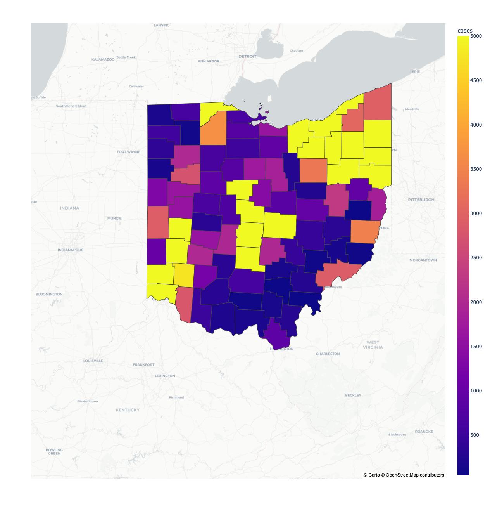

# Covid-19 cases in Ohio - A county-wise analysis

## Plot displaying total number of cases across county
### The data contains cases aggregated the 120 days since first case

	
	 

## Below line graph displays correlation of various inpendent variables impacting number of cases in each county. 
### Further explanantion: Jaccard similarity between two cases captures the degree of correlation. In our case, population's view on health, gender, politics, health and covid-19 itself for each county is measured comparatively by Jaccard coefficient.

	
	 

### install packages
`pip install -r requirements.txt`
